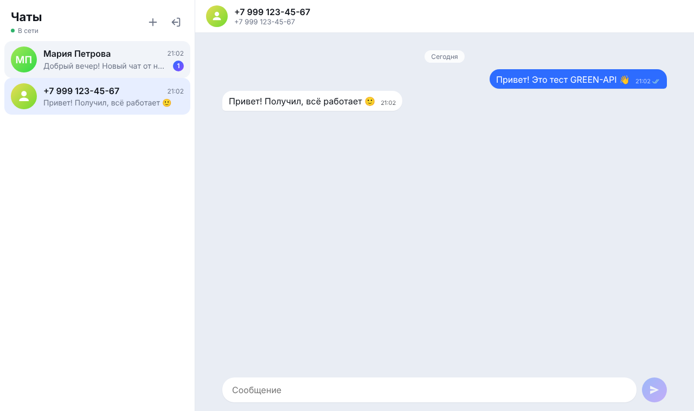
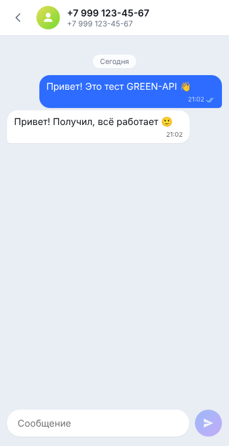

# MAX Chat на GREEN-API

Тестовое задание на должность «Фронтенд-разработчик React». Это веб-интерфейс для отправки и получения текстовых сообщений в мессенджере **MAX** через [GREEN-API](https://green-api.com/max). Внешний вид сделан по образцу [web.max.ru](https://web.max.ru/).



## Возможности

- **Вход по данным инстанса GREEN-API.** Нужны `idInstance` и `apiTokenInstance`. Данные сразу проверяются методом `getStateInstance`: инстанс должен быть в состоянии `authorized`.
- **Новый чат по номеру телефона.** Номер проверяется через `checkAccount`, оттуда же берётся `chatId` получателя в MAX.
- **Отправка текстовых сообщений** методом [`SendMessage`](https://green-api.com/v3/docs/api/sending/SendMessage/).
- **Получение сообщений** через [HTTP API](https://green-api.com/v3/docs/api/receiving/technology-http-api/): `ReceiveNotification` в режиме long-polling и `DeleteNotification` после обработки.
- **Статусы отправленных сообщений** (отправлено, доставлено, прочитано) приходят из уведомлений `outgoingMessageStatus`.
- **Сообщения, отправленные с телефона,** тоже появляются в чате (`outgoingMessageReceived`).
- **Чаты от новых собеседников** создаются автоматически и показывают счётчик непрочитанных.
- **Адаптивная вёрстка** для десктопа и мобильных, светлая и тёмная тема.

## Стек

React 19, TypeScript, Vite. Сторонних UI-библиотек и стейт-менеджеров нет: состояние хранится в `useReducer`, стили — в обычном CSS.

## Запуск локально

Нужен Node.js 18 или новее.

```bash
git clone <repo-url> max-chat
cd max-chat
npm install
npm run dev
```

Откройте http://localhost:5173.

Продакшн-сборка:

```bash
npm run build      # результат в dist/
npm run preview    # локальный просмотр сборки
```

Папку `dist/` можно выложить на любой статический хостинг (GitHub Pages, Vercel, Netlify), потому что в Vite указан `base: './'`.

## Как проверить

1. В [консоли GREEN-API](https://console.green-api.com/) создайте инстанс для MAX и авторизуйте его, отсканировав QR-код.
2. В настройках инстанса **выключите Webhook URL** (оставьте поле пустым) и включите получение уведомлений о входящих сообщениях и статусах. Без этого `ReceiveNotification` будет возвращать пустую очередь.
3. Войдите в приложение с `idInstance` и `apiTokenInstance`. `apiUrl` определяется автоматически по первым 4 цифрам `idInstance`. Если в консоли указан другой адрес, задайте его в поле «Дополнительно».
4. Нажмите «+», введите номер получателя и отправьте сообщение.
5. Ответьте с телефона получателя — ответ появится в чате.

## Структура

```
src/
  api/
    greenApi.ts        клиент GREEN-API: getStateInstance, checkAccount, sendMessage, receive/deleteNotification
    types.ts           типы ответов и уведомлений, type guards
  hooks/
    chatReducer.ts     состояние чатов и сообщений (дедупликация, статусы, непрочитанные)
    useNotifications.ts  цикл long-polling с переподключением
  components/
    LoginForm.tsx      вход
    Messenger.tsx      связывает API, уведомления и UI
    Sidebar.tsx        список чатов и создание нового
    ChatWindow.tsx     переписка и поле ввода
  utils/format.ts      номера телефонов, даты, аватары
```

## Решения

- **Дедупликация.** Отправленное сообщение сначала появляется локально со статусом «отправляется». После ответа `sendMessage` оно получает настоящий `idMessage`. Уведомление `outgoingAPIMessageReceived` с тем же id второй раз не добавляется, в каком бы порядке ни пришли ответы.
- **Очередь уведомлений.** Каждое уведомление удаляется через `DeleteNotification`, даже если его тип не обрабатывается: иначе оно заблокирует очередь.
- **Ошибки сети и API.** Ошибки показываются пользователю, а цикл получения сообщений переподключается через 3 секунды. Индикатор «В сети» стоит в шапке списка чатов.
- **Учётные данные** хранятся только в браузере пользователя: в `localStorage` при включённом «Запомнить», иначе в `sessionStorage`. Кнопка выхода их очищает.

## Скриншоты

| Вход | Мобильная версия |
| --- | --- |
|  |  |

---

Автор: Дмитрий Шелеляев · Telegram [@W3lel](https://t.me/W3lel)
